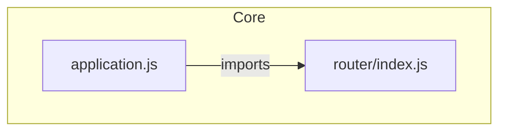

## Replace Export with Markdown-only Download (with Mermaid Diagram)

### What Changes

Replace the current PNG/SVG/PDF export dropdown with a single "Download Markdown" button. The exported `.md` file will contain:

1. **Title & metadata** — repo name, date, file/node counts
2. **Mermaid architecture diagram** — generated from the `analysisResult` nodes and edges, wrapped in a ` ```mermaid ` code fence so it renders beautifully in GitHub, VS Code, Obsidian, etc.
3. **Node details** — each node as an H2 section with type badge, summary, key functions list, code snippet in fenced block, and dependency lists

### Mermaid Generation Logic

Convert `analysisResult.nodes` and `analysisResult.edges` into a Mermaid `graph TD` diagram:
- Each node becomes a Mermaid node with its name, styled by type (different shapes: `([hooks])`, `[[components]]`, `{configs}`, `[utilities]`)
- Each edge becomes a labeled arrow (`A -->|imports| B`)
- Node IDs sanitized to be Mermaid-safe (replace `/`, `.` with `_`)

### File Changes

**`src/components/ExportButton.tsx`** — Full rewrite:
- Remove all PNG/SVG/PDF logic, `useReactFlow`, `html-to-image`, `jspdf`, `html2canvas` imports
- Remove the dropdown menu — just a single Button
- Add `generateMermaidChart(result)` function that builds the Mermaid graph string
- Add `generateMarkdown(result)` that assembles the full `.md` content with the mermaid block and node sections
- Download as a `.md` file via Blob + URL.createObjectURL

### Markdown Output Structure

```text
# {repoName} — Architecture

> Generated by GitVisualizer AI · {date}
> {totalFiles} files analyzed · {nodes.length} modules · {edges.length} connections

## Architecture Diagram



## Modules

### application.js
**Type:** component | **Path:** `lib/application.js`

**Summary:** ...

**Key Functions:**
- `app.init()`
- `app.handle()`

**Code:**
```js
// snippet
```

**Dependencies:**
- Imports: router/index.js, middleware
- Imported by: express.js
```

